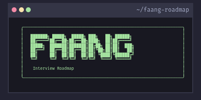

<p align="center">
  
</p>

<h1 align="center">Tech Interview Roadmap</h1>

<p align="center">
  <strong>Master interviews at ANY tech company: 85+ guides, 200+ companies, LeetCode database, system design templates & study plans</strong>
</p>

<p align="center">
  <a href="https://roadmap.swadhin.cv">🌐 Live Website</a> •
  <a href="#-overview">📖 Overview</a> •
  <a href="#-features">✨ Features</a> •
  <a href="#-quick-links">🔗 Quick Links</a> •
  <a href="CONTRIBUTING.md">🤝 Contribute</a>
</p>

<p align="center">
  
  
  
  
</p>

---

## 📖 Overview

A **comprehensive, practical roadmap** for landing jobs at **any tech company** — from FAANG to startups, from fintech to enterprise. Whether you're a junior developer starting your career or a senior engineer targeting a specific role, this repository has structured guides, real interview experiences, and practical templates to help you succeed.

### Who This Is For

| Level                   | Role                       | Path                                                     |
| ----------------------- | -------------------------- | -------------------------------------------------------- |
| 🟢 **Junior (0–3 yrs)** | Any SWE, Backend, ML, Data | [3-Month Plan](06-Study-Plans/01-Junior-3-Month-Plan.md) |
| 🟡 **Mid (3–7 yrs)**    | Specialist/Senior IC       | [6-Month Plan](06-Study-Plans/02-Mid-6-Month-Plan.md)    |
| 🔴 **Senior (7+ yrs)**  | Senior+, Staff roles       | [4-Month Plan](06-Study-Plans/03-Senior-4-Month-Plan.md) |

### Target Companies

**FAANG / MAANG:** Google, Amazon, Meta, Apple, Netflix
**Big Tech:** Uber, Airbnb, Stripe, Databricks, Discord, Spotify, Twitch
**Enterprise:** Oracle, SAP, Salesforce, ServiceNow, IBM, Cisco
**Finance & Crypto:** Goldman Sachs, JP Morgan, Citadel, Robinhood, Coinbase
**And 150+ more:** Adobe, Intel, Nvidia, Microsoft, PayPal, Shopify, Notion, Figma, Palantir...
**Plus startups, scaleups, and companies at any stage!**

---

## ✨ Features

### 📚 85+ Comprehensive Guides

- **Foundations** — DSA patterns, Computer Systems, Databases
- **Interview Playbooks** — Coding, System Design, ML Design, Behavioral, SQL
- **Role Roadmaps** — Backend, ML Engineer, Data Engineer, DevOps, MLOps
- **Company Playbooks** — Google, Amazon, Meta, Apple, Netflix & more
- **Career Guidance** — Resume, Negotiation, Rejection Recovery

### 💻 LeetCode Problem Database

- **1,400+ unique problems** tagged by difficulty
- **200+ companies** with their ask patterns
- **Frequency data** showing what's being asked
- **Progress tracking** with localStorage
- **Difficulty filtering** (Easy, Medium, Hard)
- **Timeframe analysis** (6mo, 1yr, 2yr, all-time)

### 🎨 Beautiful, Modern Website

- Dark mode with **Catppuccin theme**
- **Full-text search** across all content
- **Mobile responsive** design
- **NerdFont icons** for visual clarity
- **Interactive progress tracking**
- **Fast, static-generated pages** (Astro)

### 📊 Structured Study Plans

- **Time-based roadmaps** (3mo, 6mo, 4mo)
- **Weekly breakdowns** with specific topics
- **Real interview experiences** from candidates
- **Mock interview templates** with rubrics
- **Success metrics** and checkpoints

---

## 🔗 Quick Links

### 🚀 Get Started

- **New to interviews?** → [00-START-HERE](00-START-HERE/00-README.md)
- **Confused about hiring?** → [Hiring Pipeline Overview](00-Hiring-Pipeline/00-Index.md)
- **Need DSA help?** → [DSA Topic Breakdown](01-Foundations/03-DSA-Topic-Breakdown.md)
- **Want system design?** → [System Design Template](04-System-Design-Library/00-System-Design-Template.md)

### 📚 Study & Learn

- [**Foundations**](01-FOUNDATIONS/00-Foundations-Index.md) — DSA, Systems, Databases
- [**Role Roadmaps**](02-ROLE-ROADMAPS/00-Role-Chooser.md) — Pick your specialization
- [**Interview Playbooks**](03-INTERVIEWS/00-Interview-Index.md) — Master each interview type
- [**ML & Data Guides**](05-ML-MLOPS/00-ML-Index.md) — Specialized guides
- [**Career Advice**](08-CAREER/00-Career-Index.md) — Beyond interviews

### 💻 Practice & Resources

- [**LeetCode Database**](https://roadmap.swadhin.cv/leetcode) — 200+ companies, 1400+ problems
- [**Company Playbooks**](08-Company-Specific-Notes/00-Index.md) — Google, Amazon, Meta, etc.
- [**Mock Interview Rubrics**](05-Mock-Interviews/) — Self & peer evaluation
- [**Real Interview Stories**](03-INTERVIEWS/07-Real-Interview-Stories.md) — Learn from winners

---

## 📁 Repository Structure

```
├── 00-START-HERE/              # Quick orientation
├── 00-Hiring-Pipeline/         # ATS → Offer (end-to-end)
├── 01-FOUNDATIONS/             # DSA, Systems, Databases
├── 02-ROLE-ROADMAPS/           # SWE, Backend, ML, Data, DevOps
├── 03-INTERVIEWS/              # Coding, System Design, Behavioral
├── 04-SYSTEM-DESIGN-LIBRARY/   # Templates & patterns
├── 05-ML-MLOPS/                # ML & MLOps specialization
├── 06-DATA/                    # Data Engineering & Analytics
├── 06-Study-Plans/             # Junior, Mid, Senior timelines
├── 07-INFRA-DEVOPS/            # DevOps & SRE guides
├── 08-CAREER/                  # Resume, negotiation, career strategy
├── 08-Company-Specific-Notes/  # Company playbooks (FAANG+)
├── leetcode Question/          # 535 CSV files with problems
└── website/                    # Astro-powered website
```

---

## 📊 By The Numbers

| Metric                   | Count                   |
| ------------------------ | ----------------------- |
| **Comprehensive Guides** | 85+                     |
| **LeetCode Problems**    | 1,400+ unique           |
| **Companies Covered**    | 200+                    |
| **Study Plans**          | 3 (Junior, Mid, Senior) |
| **Role Specializations** | 7                       |
| **Interview Types**      | 6+                      |

---

## 🤝 Contributing

This roadmap is community-driven. We welcome contributions of all kinds!

**GitHub Repository:** [github.com/swadhinbiswas/FAANG-Playbook](https://github.com/swadhinbiswas/FAANG-Playbook)

**See [CONTRIBUTING.md](CONTRIBUTING.md) for:**

- 📝 How to add your interview experience
- 🐛 How to report issues
- 📚 How to improve guides
- 🏢 How to add company insights
- 💻 How to set up your development environment

**Quick contribution ideas:**

- Share your real interview experience
- Fix broken links or typos
- Improve clarity of existing guides
- Add company-specific playbooks
- Contribute LeetCode data

---

## 📚 Philosophy

This roadmap is grounded in:

- **Real hiring practices** — Official Google, Amazon, Meta principles
- **Community wisdom** — Tech Interview Handbook, Blind, LeetCode discussions
- **Technical authority** — Kubernetes, Docker, AWS, system design patterns
- **Production experience** — Rules of ML, ML Test Score, real-world DSA patterns

See [RESOURCES.md](RESOURCES.md) for detailed sources.

---

## 📄 License

MIT License — See [LICENSE.md](LICENSE.md)

---

## 🌟 Acknowledgments

This roadmap was built by aggregating best practices from:

- **FAANG interview loops** and public hiring processes
- **Successful candidates** who shared their experiences
- **Open-source communities** (Tech Interview Handbook, LeetCode)
- **Engineering blogs** from top tech companies

---

<p align="center">
  <strong>Ready to ace your interviews? Start here:</strong>
</p>

<p align="center">
  <a href="https://roadmap.swadhin.cv" style="font-size: 16px; font-weight: bold;">🌐 Visit roadmap.swadhin.cv</a>
</p>

<p align="center">
  <a href="CONTRIBUTING.md">🤝 Contribute</a> •
  <a href="https://github.com/1nnovat1on/BigTech-FAANG-Job-Roadmap/issues">🐛 Report Issue</a> •
  <a href="https://github.com/1nnovat1on/BigTech-FAANG-Job-Roadmap/discussions">💬 Discuss</a>
</p>

<p align="center">
  <em>Good luck with your interviews! 🎯</em>
</p>
